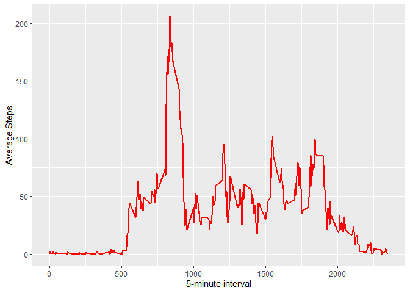
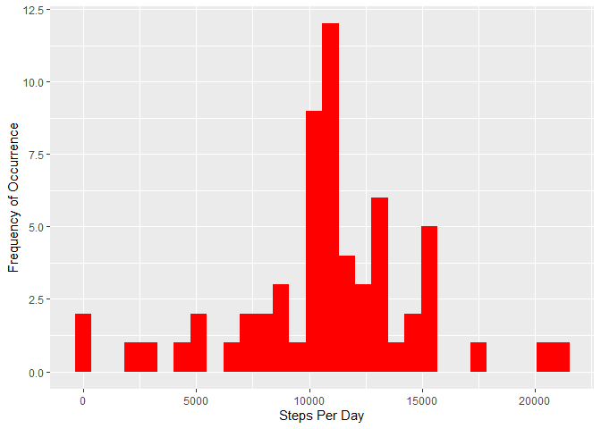
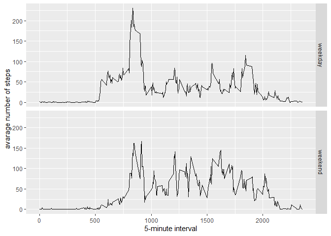

# Loading and preprocessing the data
### 1) Load the data


```r
excel_data <- read.csv(file="activity.csv", header=TRUE, nrows=17569)
head(excel_data)
```

```
##   steps       date interval
## 1    NA 2012-10-01        0
## 2    NA 2012-10-01        5
## 3    NA 2012-10-01       10
## 4    NA 2012-10-01       15
## 5    NA 2012-10-01       20
## 6    NA 2012-10-01       25
```

### 2) Process/transform the data (if necessary) into a format suitable for your analysis

Removing the rows with 'NA' values. Changing the format of the date, converting the class of the interval column to 'factor'


```r
new_excel_data <- excel_data[complete.cases(excel_data),]
new_excel_data$date <- as.Date(new_excel_data$date, "%Y-%m-%d")
new_excel_data$interval <- as.factor(new_excel_data$interval)
head(new_excel_data)
```

```
##     steps       date interval
## 289     0 2012-10-02        0
## 290     0 2012-10-02        5
## 291     0 2012-10-02       10
## 292     0 2012-10-02       15
## 293     0 2012-10-02       20
## 294     0 2012-10-02       25
```

# What is mean total number of steps taken per day?
### 1) Calculate the total number of steps taken per day


```r
dailysteps <- tapply(new_excel_data$steps, new_excel_data$date, sum)
head(dailysteps)
```

```
## 2012-10-02 2012-10-03 2012-10-04 2012-10-05 2012-10-06 2012-10-07 
##        126      11352      12116      13294      15420      11015
```

### 2) Make a histogram of the total number of steps taken each day


```r
library(ggplot2)
qplot(dailysteps, geom="histogram", xlab='Total steps per day', ylab='Frequency of Occurrence')
```

<!-- -->

### 3) Calculate and report the mean and median of the total number of steps taken per day

```r
MeanDailySteps <- mean(dailysteps)
MedianDailySteps <- median(dailysteps)
MeanDailySteps
```

```
## [1] 10766.19
```

```r
MedianDailySteps
```

```
## [1] 10765
```


# What is the average daily activity pattern?\
### 1) Make a time-series plot (type = "1")


```r
interval_steps <- aggregate(steps ~ interval, data = new_excel_data, FUN = mean)
interval_steps$interval <- as.integer(levels(interval_steps$interval)[interval_steps$interval])
ggplot(interval_steps, aes(x = interval, y = steps)) + geom_line(col = "red", size = 1) + labs(x = "5-minute interval", y = "Average Steps")
```

<!-- -->

### 2) Which 5-minute interval, on average across all the days in the dataset, contains the maximum number of steps?

```r
Interval_max_steps <- interval_steps[which.max(interval_steps$steps),]
Interval_max_steps
```

```
##     interval    steps
## 104      835 206.1698
```


# Imputing missing values
### 1) Calculate and report the total number of missing values in the dataset


```r
missing_values <- sum(is.na(excel_data$steps))
missing_values
```

```
## [1] 2304
```


### 2/3) Devise a strategy for filling in all of the missing values in the dataset. Create a new dataset that is equal to the original dataset but with the missing data filled in.


```r
updated_excel_data <- excel_data
na_index <- which(is.na(updated_excel_data$steps))
  for (i in na_index) {
    index <- updated_excel_data$interval[i]
   updated_excel_data$steps[i] <- interval_steps$steps[interval_steps$interval == index]
  }
```
To verify that all the missing values in the new dataframe have been removed:

```r
updated_missing_values <- sum(is.na(updated_excel_data$steps))
updated_missing_values
```

```
## [1] 0
```

### 4) Make a histogram of the total number of steps taken each day and Calculate and report the mean and median total number of steps taken per day. 


```r
updated_daily_steps <- aggregate(steps ~ date, data = updated_excel_data, FUN=sum)
ggplot(updated_daily_steps, aes(x = steps)) + geom_histogram(fill = "red") + labs(x = "Steps Per Day", y = "Frequency of Occurrence")
```

<!-- -->
The mean and median of the updated table is shown below:

```r
mean_updated_daily_steps <- mean(updated_daily_steps$steps)
median_updated_daily_steps <- median(updated_daily_steps$steps)
mean_updated_daily_steps
```

```
## [1] 10766.19
```

```r
median_updated_daily_steps
```

```
## [1] 10766.19
```
It can be seen that both the mean and the median of the updated data frame match, unlike the data frame with 'NA' values present in it.


# Are there differences in activity patterns between weekdays and weekends?

### 1) Create a new factor variable in the dataset with two levels – “weekday” and “weekend” indicating whether a given date is a weekday or weekend day.


```r
updated_excel_data$dateType <-  ifelse(as.POSIXlt(updated_excel_data$date)$wday %in% c(0,6), 'weekend', 'weekday')
```

### 2) Make a panel plot containing a time series plot (type="1")


```r
aggregated_updated_excel_data <- aggregate(steps ~ interval + dateType, data=updated_excel_data, mean)
ggplot(aggregated_updated_excel_data, aes(interval, steps)) + geom_line() + facet_grid(dateType ~ .) +xlab("5-minute interval") + ylab("avarage number of steps")
```

<!-- -->
